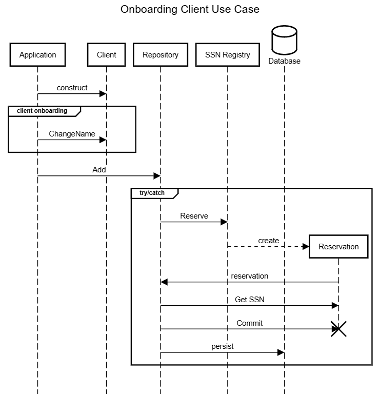

In a [previous post][successor], I introduced Identity Obsession. Identity Obsession can introduce race conditions relating to consistency with Domain Entities and other complexity. In that post, I point out that most entities have an inherent (implicit) local identity and that any additional global Identifiers are due to persistence (RDBMS) implementation details. I recommended that Identifiers be something in your persistence layer rather than your Domain layer. I won't rehash that post more than that here, but you may want to read that first.

It can be perceived as _easy for me to say_ when it comes to design constraints of Aggregates and Entities when implementing the persistence layer. This perception is probably most apparent with technologies like Entity Framework Core (EF) and that Entity Framework's support for Domain-Driven Design has been an afterthought. When dealing with external sources and targets of data, the Data Transfer Object pattern is recommended. Technically, EF supports persistence via DTOs.

Entity Framework can rarely do what it does out-of-the-box, provided classes are designed with a Domain-Driven Design mindset. Impedance Mismatch rears its ugly head resulting in translating data to/from the limited data types that databases tend to have (see `HasConversion`, `HasKey`, et al.) Despite best practices that recommend that Entities be implemented as POCOs and relational mapping be configured with fluent builders&mdash;outside of the Domain Layer&mdash;the needs and constraints of databases can easily leak into the design and evolution of Domain Objects.

In this post, I will provide an example of configuring Entity Framework to work with Domain Objects that don't suffer from Identity Obsession. The scenario (or use-case) I'll show with this Domain Object is onboarding a Client to the point they will have a Domain Identifier assigned. The Domain I introduced in my previous post involved SSNs; we can presume the Social Security Administration would be the Domain context. I'm sure none of my readers work in this context, but I believe it to be understandable by many people, making it a good example of Domain Identity. For my Canadian friends, replace "SSN" with "SIN" and "Social Security Administration" with "Service Canada." 

Entity Framework is a persistence/infrastructure implementation detail, and the Repository Pattern is used to isolate those details from the Domain. I gave an example repository in my previous post; for this example, I've expanded it to support asynchronous and the Result Pattern:

```csharp
public interface IClientRepository
{
    Task<Result<Client>> FindBySsnAsync(Ssn ssn, CancellationToken cancellationToken);
    Task<Result> SaveAsync(Client client, CancellationToken cancellationToken);
    Task<Result<Ssn>> AddAsync(Client client, CancellationToken cancellationToken);
	Task<Result<IEnumerable<Client>>> FindClientsAsync(CancellationToken cancellationToken);
}
```

This Repository provides the ability to find a Client by SSN (`FindBySsnAsync`), save a `Client` after being updated (`SaveAsync`), and add a new `Client` by allocating a new SSN (`AddAsync`.)

Elements within a container naturally have container Identity. The container understands how to identify individual elements based on an identifier. Contained elements, therefore, do not also have to take on that burden. For example:

```csharp
public class Client(string givenName, string familyName)
    : Person(givenName, familyName)
{
    public void ChangeName(string givenName, string familyName)
    {
        GivenName = givenName;
        FamilyName = familyName;
    }
}
```

I've expanded `Client` to support an update scenario (`ChangeName`) so that there is Domain behavior.

|Quote|
|:-:|
|"All models are wrong, but some are useful"|

The use-case of working with a Domain Object (`Client`) before needing an SSN to be persisted might follow a sequence like this:



A `Client` instance exists for a time before a Domain Identifier is allocated for it. However, our database requires an SSN for each client record. So, we need to configure Entity Framework to accommodate that detail and include a primary key. We do that through an `IEntityTypeConfiguration<T>` implementation like this:

```csharp
public class ClientEntityTypeConfiguration : IEntityTypeConfiguration<Client>
{
    public void Configure(EntityTypeBuilder<Client> builder)
    {
        // Create a string "Id" Shadow Property to hold GUID values
        builder.Property<string>(ColumnNames.Id)
            .HasColumnType("varchar(36)")
            .HasMaxLength(36);
        builder.HasKey(ColumnNames.Id);

        // Create a string "Ssn" Shadow Property that uses the type Sss,
        // with conversion
        builder.Property<Ssn>(ColumnNames.Ssn)
            .HasColumnType("varchar(11)")
            .HasMaxLength(11)
            .HasConversion(ssn => ssn.ToString(), value => Ssn.Parse(value))
            .IsRequired();
}
```

As with any `IEntityTypeConfiguration<T>` implementation, we're configuring the primary key and other properties with property-specific requirements. This implementation may differ from other implementations because we're configuring _shadow properties_ for our identifiers. The `DbContext` implementation will be responsible for the persistence concern of generating the primary key value, and the repository will be responsible for the Domain concern of generating the Domain Identifier (SSN).

Let's look at that `DbContext` implementation (I'm using SQLite for this implementation):

```csharp
public class DatabaseContext : DbContext
{
	protected override void OnModelCreating(ModelBuilder modelBuilder)
	{
		modelBuilder.ApplyConfiguration(new ClientEntityTypeConfiguration());

		base.OnModelCreating(modelBuilder);
	}

	public async Task<Result<Client>> GetClientBySsnAsync(Ssn ssn, CancellationToken cancellationToken)
	{
		var client = await Clients
			.SingleOrDefaultAsync(c => EF.Property<Ssn>(c, ColumnNames.Ssn) == ssn, cancellationToken);

		return client ?? Result<Client>.NotFound();
	}

	public async Task<Result<Client>> GetClientByIdAsync(Guid id, CancellationToken cancellationToken)
	{
		var client = await Clients
			.SingleOrDefaultAsync(c => EF.Property<string>(c, ColumnNames.Id) == id.ToString(), cancellationToken);

		return client ?? Result<Client>.NotFound();
	}

	public Result<Ssn> GetClientSsn(Client client)
	{
		var entry = Entry(client);
		var currentValue = entry.Property(ColumnNames.Ssn).CurrentValue as Ssn;

		return currentValue ?? Result<Ssn>.NotFound();
	}

	public async Task AddClientAsync(Client client, Ssn ssn, CancellationToken cancellationToken)
	{
		var entry = Entry(client);
		entry.Property(ColumnNames.Ssn).CurrentValue = ssn;
		entry.Property(ColumnNames.Id).CurrentValue = Guid.NewGuid().ToString();
		await AddAsync(client, cancellationToken);

		await SaveChangesAsync(cancellationToken);
	}
	public DbSet<Client> Clients { get; set; }

	protected override void OnConfiguring(DbContextOptionsBuilder optionsBuilder)
	{
		optionsBuilder.UseSqlite($"Data Source={DataSourcePath}");
	}

	public static string DataSourcePath {
		get
		{
			var localAppDataPath = Environment.GetFolderPath(Environment.SpecialFolder.LocalApplicationData);
			return Path.Join(localAppDataPath, "clients.db");
		}
	}
}
```

Notable is `AddClientAsync`, where it accepts an `Ssn` value, sets the shadow property value for that database column, and generates the primary key by calling `Guid.NewGuid()`. `DatabaseContext` encapsulates the implementation detail of shadow properties. I've chosen to generate a`Guid` in code rather than by the database for clarity. As a database concern, it could go either way. Also notable is the method `GetClientSsn`, which shows how an SSN can be obtained outside the Domain (e.g., for Presentation concerns.)

Next, let's look at an implementation of `IClientRepository`:

```csharp
public class ClientRepository(DatabaseContext dbContext, ISsnRegistry ssnRegistry) : IClientRepository
{
	private readonly DatabaseContext dbContext = dbContext;
	private readonly ISsnRegistry ssnRegistry = ssnRegistry;

	public Task<Result<IEnumerable<Client>>> FindClientsAsync(CancellationToken _)
	{
		Result<IEnumerable<Client>> result = dbContext.Clients;
		return Task.FromResult(result);
	}

	public Task<Result<Client>> FindBySsnAsync(Ssn ssn, CancellationToken cancellationToken)
	{
		return dbContext.GetClientBySsnAsync(ssn, cancellationToken);
	}

	public async Task<Result<Ssn>> AddAsync(Client client, CancellationToken cancellationToken)
	{
		var reservationResult = ssnRegistry.Reserve();
		if (reservationResult.IsError()) return Result<Ssn>.Error();

		using var ssnReservation = reservationResult.Value;
		Ssn newSsn = new(ssnReservation.Value);
		await dbContext.AddClientAsync(client, newSsn, cancellationToken);
		await dbContext.SaveChangesAsync(cancellationToken);
		ssnReservation.Commit();
		return newSsn;
	}

	public async Task<Result> SaveAsync(Client client, CancellationToken cancellationToken)
	{
		var entry = dbContext.Entry(client);
		switch (entry.State)
		{
			case EntityState.Detached:
				{
					var addResult = await AddAsync(client, cancellationToken);
					return addResult.IsSuccess
						? Result.Success()
						: Result.CriticalError(addResult.Errors.ToArray());
				}
			case EntityState.Modified:
				await dbContext.SaveChangesAsync(cancellationToken);
				return Result.Success();
			default:
				return Result.Success();
		}
	}

	public Result<Ssn> GetClientSsn(Client client)
	{
		return dbContext.GetClientSsn(client);
	}

	public Task<Result<Client>> FindByIdAsync(Guid id, CancellationToken cancellationToken)
	{
		return dbContext.GetClientByIdAsync(id, cancellationToken);
	}
}
```
Since the primary key and the SSN storage is a Persistence concern, the `DbContext` implementation is where the logic to work with Shadow Properties lives.

`SaveAsync` and `FindBySsnAsync` simply encapsulate `DbContext.SaveChangesAsync` and `DatabaseContext.GetClientBySsnAsync` respectively. `FindClientsAsync` finds all the client instances (typically, this would have a filter, which I've omitted for clarity.) SSN allocation is outside the scope of this post. But, because SSN allocation is a Domain concern, I'll show where it might fit in an orchestration with `DatabaseContext` within `AddAsync` (using a fictitious `ISsnRegistry` object that manages generating/reserving then committing an SSN value--completing/committing the reserved value if it is successfully persisted to the database.) I've included `GetClientSsn` as an example of how an SSN can be obtained outside the Domain (e.g., for Presentation concerns.) Also, I've included `FindByIdAsync` as an example of how we can find a `Client` instance based on a primary key value.

|Caveat|
|:-:|
|Storing SSNs in a database is frowned upon. This example is for clarity, the value should be hashed or encrypted before storing in the database. Look ups based on last-four & name are beyond the scope of this post|

## Summary

Entity Framework makes mapping Entity properties to columns in a relational database easy. But don't let that ease of use let Persistence concerns leak into your Domain. With a clear understanding of what Domain concerns are, what Persistence concerns are, and what Presentation concerns are Entity Framework can easily be leveraged to support loosely coupling the Persistence concerns from Entities.

The code from this post can be found in [GitHub](https://github.com/peteraritchie/IdentityObsession).

[successor]: identity-obsession-and-domain-driven-design