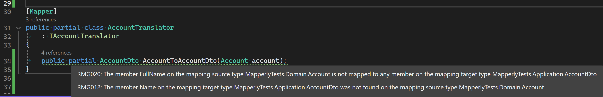

<!-- Mapping/Translation series intro boilerplate -->
Modern software applications heavily rely on external services, making data transfer a crucial aspect of application functionality. Invariably, data transfer involves translating an internal representation of information to data compatible with a particular communication channel. High-level programming languages empower programmers to model abstractions in high-level types independent of lower-level implementation details. This internal representation of data is sometimes called _abstract syntax_, which is purposely devoid of the specifics (_concrete syntax_) required by the channel and, or the receiver. Translation from one syntax to another must first map source data elements to target data elements. That mapping includes the necessary translation method/function.

<!-- Data Transfer Object boilerplate pull quote/box copy -->
|Data Transfer Objects|
|---|
|Defining concrete syntax in high-level languages is so essential that a design pattern is devoted to it. The Data Transfer Object<sup>\[[ppoe]\]</sup> design pattern describes declaring high-level types to describe aspects of concrete syntax.|

This installment details the mapping and translation of Data Transfer Objects with a package named [`Mapperly`][mapperly-git] ([Riok.Mapperly][mapperly-nuget]).

Mapperly accomplishes translation by being a .NET Source Generator, meaning the translation code is generated and exists when your application is compiled. The translation code, therefore, does not need to jump through a bunch of hoops by evaluating expressions and dynamically generating types and methods. Being a Source Generator makes Mapperly pleasantly different from other mappers like AutoMapper and Mapster. You have to declare the intent to translate from one type to another by declaring a partial method (in a partial class decorated with the `MapperAttribute`) that tells Mapperly what the source and destination types are (the method that returns the _destination_ type and accepts the _source_ type as an argument.) The name of the class method is up to you. For example:

```csharp
[Mapper]
public partial class AccountTranslator
{
	public partial AccountDto AccountToAccountDto(Account account);
}
```

Mapperly determines how to translate each property based on their names and types (the default _convention_). In our simple case, it would generate a method similar to:

```csharp
{
    public partial class AccountTranslator
    {
        [global::System.CodeDom.Compiler.GeneratedCode("Riok.Mapperly", "4.1.0.0")]
        public partial global::MapperlyTests.Application.AccountDto AccountToAccountDto(global::MapperlyTests.Domain.Account account)
        {
            var target = new global::MapperlyTests.Application.AccountDto();
            target.Id = account.Id;
            target.Name = account.Name;
            target.CreationDate = account.CreationDate;
            return target;
        }
    }
```

Mapperly supports immutable record types, so if you wanted to use `record` with `AccountDto` like this:

```csharp
public record AccountDto(Guid Id, DateOnly CreationDate, string Name);
```

And with those immutable record types Mapperly will generate code that passes arguments to the constructor:

```csharp
        [global::System.CodeDom.Compiler.GeneratedCode("Riok.Mapperly", "4.1.0.0")]
        public partial global::MapperlyTests.Application.AccountDto AccountToAccountDto(global::MapperlyTests.Domain.Account account)
        {
            var target = new global::MapperlyTests.Application.AccountDto(account.Id, account.CreationDate, account.Name);
            return target;
        }
```

Say goodbye to `ConstructUsing` (as well as `ForMember`, et al.)

## Mapping by Convention

The raison d'etre of mapping/translation frameworks is to make translating one data type to another as simple as possible. A key feature of these frameworks is to map by convention, which automatically maps fields or properties based on criteria like name and data type. As we can see from the generated code above, Mapperly, by convention, figures out the source and target properties to translate. What's nice about Mapperly is that you can see the results of applying that convention by looking at the generated code (Ctrl-click the `partial` method name to go to the generated code.)

## Custom Mapping

When we start (greenfield) development, our DTOs are usually closely aligned with our domain objects, so by-convention mapping is our friend. However, an important reason for having two abstractions is that they can evolve independently. Eventually, as we gain a better understanding of the domain or clients of the communication channel, we will need to make changes that cause our DTO and Domain Objects to diverge. We can manage that divergence by extending the by-convention mapping to include custom mapping on a per-property basis. Mapperly supports this through members of the `Mapper`-decorated class.

For example, we've gained a better understanding of the domain, and an Account doesn't necessarily have a "name" but has an associated account holder with a given and family name. That understanding may make its way into the domain like this:

```csharp
public class Account(Guid id, DateOnly creationDate, string accountHolderGivenName, string accountHolderFamilyName)
{
	public Guid Id { get; } = id;
	public string AccountHolderGivenName { get; private set; } = accountHolderGivenName;
	public string AccountHolderFamilyName { get; private set; } = accountHolderFamilyName;
	public DateOnly CreationDate { get; } = creationDate;

	public void ChangeName(string accountHolderGivenName, string accountHolderFamilyName)
	{
		AccountHolderGivenName = accountHolderGivenName;
		AccountHolderFamilyName = accountHolderFamilyName;
	}
}
```

Receivers of our `AccountDto` might be unable to accommodate that change immediately, so we may deal with that by mapping properties differently. Instead of including `FamilyName` and `GivenName` in this version of `AccountDto`, we may concatenate the given and family name and assign it to `AccountDto.Name`.

You can configure this type of two properties to one property conversion with the `MapPropertyFromSource` attribute. More than just the name of the two properties is needed for Mapperly to automatically figure out what to do (concatenate, concatenate with delimiter, etc.). So, we use `MapPropertyFromSource` to point to a method that takes the source type and returns an instance of a type assignable to the destination property.  In this example, a `MapGivenFamilyNames` method:

```csharp
[Mapper]
public partial class AccountTranslator
	: IAccountTranslator
{
	[MapPropertyFromSource(target: nameof(AccountDto.Name), Use = nameof(MapGivenFamilyNames))]
	public partial AccountDto AccountToAccountDto(Account account);
	private string MapGivenFamilyNames(Account account)
	{
		return account.AccountHolderGivenName + ' ' + account.AccountHolderFamilyName;
	}
}
```

Mapperly supports arrays of strings for `target` so you can map to nested properties of properties.

Mapperly also supports property-to-property mapping of properties that a simple matching strategy wouldn't match.  Given the same client application constraints and the domain understanding uncovered that the `Name` property doesn't fit in the ubiquitous language but `FullName` does, we would use `MapPropertyAttribute` to tell Mapperly how to assign the `AccountDto.Name` property:

```csharp
[Mapper]
public partial class AccountTranslator
	: IAccountTranslator
{
	[MapProperty(source: nameof(AccountDto.Name), target: nameof(Account.FullName))]
	public partial AccountDto AccountToAccountDto(Account account);
}
```
|NOTE|
|:-:|
|The constructor for `MapPropertyFromSourceAttribute` has only one parameter, the `target`.  The constructor for `MapPropertyAttribute` has two, the `source` and the `target`, so it _may look like_ the parameters are in a different order. C#'s _named arguments_ shines here to clarify intent.| 

Technically, attributes like `MapPropertyFromSourceAttribute` and `MapPropertyAttribute` work with string names of classes and members. Use the `name of` expression so that identifiers get used at compile-time, as seen in the above example.

## But Wait, There's More

A benefit of being a Source Generator is that Mapperly can generate compiler/analyzer warnings when not all properties are mapped from or to.  If you're following along and you updated `Account`, renaming `Name` to `FullName`, you would have noticed RMG020 and RMG012 warnings:



## Dependency Injections with Mapperly

Other mappers have initialization and startup requirements making their use in Dependency Injection more than just registering an implementation of an interface (`services.AddScoped<ITheInterface, TheImplementation>();`) and require an `Add{Technology}()` method call (like `AddMapster` or `AddAutoMapper`.) Since Mapperly generates the translation code at compilation, you only have to register the translating type (e.g., `services.AddScoped<AccountTranslator>()`) and declare the dependency in the constructors of types that need to invoke translators (e.g., `public class AccountService(AccountTranslator accountTranslator){/*...*/}`.)

If you're interface-obsessed when it comes to Dependency Injection, you're free to create an interface to use and configure your services appropriately, for example:

```csharp
public interface IAccountTranslator
{
	public AccountDto AccountToAccountDto(Account account);
}
//...
[Mapper]
public partial class AccountTranslator
	: IAccountTranslator
{
	public partial AccountDto AccountToAccountDto(Account account);
}
//...
services.AddScoped<IAccountTranslator, AccountTranslator>();
```

Then declare the dependency in the constructors of types that need to invoke translators (e.g., `public class AccountService(IAccountTranslator accountTranslator){/*...*/}`.)

## Where Does Mapping and Translation Occur?

Data transfer can occur in different layers. Data transfer triggers a website or API (presentation layer); the application layer requests external services via an infrastructure layer to transfer data to and from. I'm often asked where that mapping and translation source code should exist and in which project in the solution. It's important to remember that we're dealing with multiple layers. The presentation layer is typically where the process entry point is, so initialization (DI container configuration) occurs here. That initialization depends at least indirectly on the translation code to configure services that perform the translation.

Translation of web/API models exist in the presentation layer because that's where _that_ data transfer occurs. It can get complex when more layers are in their own project or are their own artifact. I recommend that DTOs live in the project where the data transfer occurs because they should be viewed as an implementation detail of the facade/adapter performing the data transfer. This typically means that the translation codes lives along side the DTOs because you want to keep implementation details encapsulated. The translation should be made available through an interface that is configured by your Dependency Injection container. I'll leave the complexity of doing that in the context of project-scoped layers for another post.

|NOTE|
|:-:|
|Regardless of whether you have multiple presentation layers or an independent application layer, translation logic _should not_ be a responsibility in the Domain layer.|

[dto]: https://martinfowler.com/eaaCatalog/dataTransferObject.html
[ppoe]: https://amzn.to/3SR8c73
[mapperly-git]: https://github.com/riok/mapperly
[mapperly-nuget]: https://www.nuget.org/packages/Riok.Mapperly/
[register-service-groups]: https://learn.microsoft.com/en-us/dotnet/core/extensions/dependency-injection#register-groups-of-services-with-extension-methods