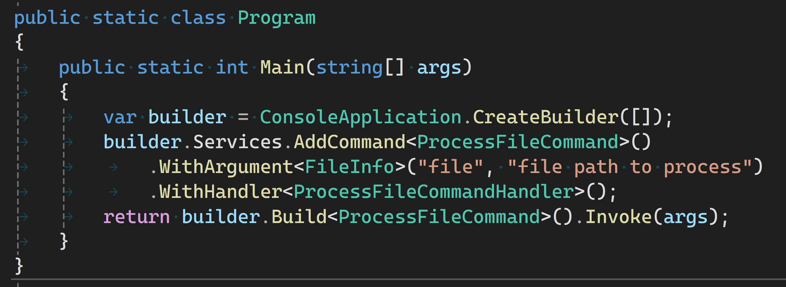

## Mission, Inspiration

The mission of CommandLineExtensions is to help make command-line argument parsing simpler while leveraging Microsoft-supported `System.CommandLine`.

The inspiration for CommandLineExtensions spawns from ConsoleApplicationBuilder, which makes it easier to create console applications that utilize modern .NET patterns and practices like Dependency Injection, Configuration, etc. Console applications revolve around command-line options and arguments, and more easily integrating them with modern .NET patterns and practices is essential.

ConsoleApplicationBuilder is a .NET Dependency Injection (`IServiceCollection`) extension with a fluent interface to give console application startup a similar fluent experience as other .NET frameworks. CommandLineExtensions continues that goal by providing fluent .NET Dependency Injection interface extensions to define options and arguments for console applications.

## Why Use CommandLineExtensions

If what ConsoleApplicationBuilder does doesn't interest you, neither will CommandLineExtensions. Without ConsoleApplicationBuilder CommandLineExtensions is just a builder pattern facade over System.CommandLine that requires a `IServiceCollection` implementation. System.CommandLine is an established library and provides a ton of value to .NET console application developers. A builder facade that enables support for DI might only be a subtle improvement for many. I get that; I started this because it interested me.

If integrating with modern .NET practices like DI, configuration, and application settings is important to you, here are some benefits of using CommandLineExtensions to define command-line options and arguments (or "parameters"):

- simplified configuration into "parts" or "phases" as contextual guardrails to enforce constraints like type safety
- integration with established .NET patterns and practices
- multi-step, piecemeal definition of command-line parameters improving readability.
- Semantically independent of System.CommandLine API, allowing you to focus on the configurability important to your app
- fluency of the interface frees you from instantiating multiple framework objects unrelated to your app

### Simple Multi-step, Piecemeal Definition of Parameters

CommandLineExtensions provides fluent interface to configure command-line parameters in a sequence of phases or steps. A simple example of configuring the root command to take a file option and configure a handler delegate. The `WithOption` call begins a context (phase) that configures the current strongly-typed option. Within this context, the call to `WithHandler` is strongly-typed to the single option type of `FileInfo?`:

```csharp
builder.Services.AddCommand()
    .WithDescription("Sample app for System.CommandLine")
    .WithOption<FileInfo?>("--file", "The file to read and display on the console.")
    .WithHandler(file => 
    {
        ReadFile(file!);
    });
return builder.Build<RootCommand>.Invoke(args);
```

To do same thing with only System.CommandLine is possible with an explicitly instantiated `Option<FileInfo?>` re-used in the call to `SetHandler`:

```csharp
var fileOption = new Option<FileInfo?>(
    name: "--file",
    description: "The file to read and display on the console.");

var rootCommand = new RootCommand("Sample app for System.CommandLine");
rootCommand.AddOption(fileOption);

rootCommand.SetHandler((file) => 
    { 
        ReadFile(file!); 
    },
    fileOption);

return await rootCommand.InvokeAsync(args);
```

The phased or stepwise approach might be more apparent when dealing with multiple commands or subcommands:

```csharp
var builder = ConsoleApplication.CreateBuilder(args);
builder.Services.AddCommand() // 👈 Start root command context
	.WithSubcommand<ReadCommand>()  // 👈 start read subcommand context
		.WithArgument<FileInfo>("file", "file path to process")
		.WithSubcommandHandler(file => Console.WriteLine($"read <file> argument = {file.Name}"))
	.WithSubcommand<WriteCommand>()  // 👈 start write subcommand context
		.WithArgument<FileInfo>("file", "file path to process.")
		.WithArgument<string>("text", "text to write to file, quoted.")
		.WithSubcommandHandler((file, text) => Console.WriteLine($"write <file> argument = {file.Name} with text '{text}'."))
	.WithHandler(() => Console.WriteLine("Please choose read or write subcommand."));

return builder.Build<RootCommand>().Invoke(args);
```

The first call to `WithSubcommandHandler` has the context of a single parameter of type `FileInfo` and expects a delegate that takes a single argument of type `FileInfo`. The only thing that will compile here is a delegate with a single parameter. The second independent call to `WithSubcommandHandler` has a different context, one with two parameters: one of type `FileInfo` and one of type `string`. There is no way to mix up assigning a delegate to the wrong subcommand.

### Example: Dependency Injection

CommandLineExtensions can do what it does through dependency injection--building up a configuration context to the point where a command is built and the required dependencies are resolved and instantiated. Put another way: all the types you use with CommandLineExtensions are resolved via the dependency injection container. If you want to use `ILogger<T>` in a command handler, simply include it as a constructor parameter, for example:

```csharp
public class LoggingCommandHandler(ILogger<LoggingCommandHandler> logger) : ICommandHandler<FileInfo>
{
    public int Execute(FileInfo fileInfo)
    {
        Console.WriteLine(
            $"File {fileInfo.Name} is {fileInfo.Length} bytes in size and was created on {fileInfo.CreationTime}."));
        return 0;
    }
}
//...
public class Program
{
    public int Main(string[] args)
    {
        var builder = ConsoleApplication.CreateBuilder(args);
        builder.Services.AddCommand()
            .WithDescription("Dependency Injection sample")
            .WithOption<FileInfo>("--file", "An option whose argument is parsed as a FileInfo")
            .WithHandler<LoggingCommandHandler>();
        return builder.Build<RootCommand>().Invoke(args);
    }
}
```

A similar<super>*</super> thing in System.CommandLine would require code like the following:

```csharp
public class Program
{
    public int Main(string[] args)
    {
        var fileOption = new Option<FileInfo?>(
            name: "--file",
            description: "An option whose argument is parsed as a FileInfo");

        var rootCommand = new RootCommand("Dependency Injection sample");
        rootCommand.Add(fileOption);

        rootCommand.SetHandler((fileOptionValue, logger) =>
            {
                DoRootCommand(fileOptionValue!, logger);
            },
            fileOption, new MyCustomBinder());

        rootCommand.Invoke(args);

        return 0;
    }
    static void DoRootCommand(FileInfo aFile, ILogger logger)
    {
        Console.WriteLine($"File = {aFile?.FullName}");
        logger.LogCritical("Test message");
    }
}

public class MyCustomBinder : BinderBase<ILogger>
{
    protected override ILogger GetBoundValue(
        BindingContext bindingContext) => GetLogger(bindingContext);

    ILogger GetLogger(BindingContext bindingContext)
    {
        using ILoggerFactory loggerFactory = LoggerFactory.Create(
            builder => builder.AddConsole());
        ILogger logger = loggerFactory.CreateLogger("LoggerCategory");
        return logger;
    }
}
```

*: `ILogger<T>` injection is accomplished, but without using Microsoft.Extensions.DependencyInjection.

## Caveats

This is an MVP to gauge interest and to get feedback. It's functional, but minimal in a few ways.

### Limited Options/Arguments

Parameters are limited to two per command. Two is much lower than the System.CommandLine's limit of eight. Support for more than two will be added in the near future.

### Default Value Factories

Default value factories are not supported. System.CommandLine supports default values for options via a factory method, for example:

```csharp
var fileOption = new Option<FileInfo?>(
    name: "--file",
    description: "An option whose argument is parsed as a FileInfo");
fileOption.SetDefaultValueFactory(() => $"{DateTime.Now:MMMM}"); // 👈 delegate to create a new value
var rootCommand = new RootCommand("Do something with a file.");
rootCommand.Add(fileOption);

rootCommand.SetHandler(fileOptionValue =>
    {
        Console.WriteLine($"Received {fileOptionValue} for file name.");
    },
    fileOption);

return rootCommand.Invoke(args);
```

Default values for options _are_ supported.  For example:

```csharp
var builder = ConsoleApplication.CreateBuilder(args);
builder.Services.AddCommand()
    .WithOption<FileInfo?>("--file", "An option whose argument is parsed as a FileInfo")
    .WithDefault($"{DateTime.Now:MMMM}") // 👈 create default value here
    .WithHandler(fileOptionValue =>
        {
            Console.WriteLine($"Received {fileOptionValue} for file name.");
        });
return builder.Build<RootCommand>.Invoke(args);
```

The vision is that CommandLineExtensions be very loosely coupled to System.CommandLine--in most cases, it is coupled only to _concepts_ (like _by name_--sometimes referred to as Connascence of Name). Toward that vision, the CommandLineExtensions fluent interface doesn't use System.CommandLine types directly, so there is no way to use pre-defined types like closed-generic types implementing `Option<T>`. I've considered that, and if you feel that's important, please thumb up this issue: [`Consider supporting Option<T>-derived types.`](https://github.com/peteraritchie/ConsoleApplicationBuilder/issues/13)

## Getting Started

Getting started with CommandLineExtensions is very easy. It begins with either creating a console application with ConsoleApplicationBuilder dotnet new template or adding the ConsoleApplicationBuilder NuGet package to an existing console application. (For more information, please see [Announcing ConsoleApplicationBuilder, DI in console applications, simply](https://blog.peterritchie.com/posts/announcing-consoleapplicationbuilder).) Then add the [PRI.CommandLineExtensions](https://www.nuget.org/packages/PRI.CommandLineExtensions) NuGet package.

Configuring command-line parameters starts by adding a command; if you don't have a "command," the implied command is a _root command_ added with the bare `AddCommand()` extension method:

```csharp
var builder = ConsoleApplication.CreateBuilder(args);
builder.Services.AddCommand() // 👈 step 1, configure a command
```

Then, you can start adding options (named parameters) or arguments (unnamed parameters). For example, if you want to accept a required file name on the command-line with a command-line option of `--file`, you could do this:

```csharp
var builder = ConsoleApplication.CreateBuilder(args);
builder.Services.AddCommand()
    .WithRequiredOption<FileInfo>("--file", "file path to process") // 👈 step 2, add an option
```

Next, you need to configure what you want to process the parameter value with--a command handler:

```csharp
var builder = ConsoleApplication.CreateBuilder(args);
builder.Services.AddCommand()
    .WithRequiredOption<FileInfo>("--file", "file path to process")
    .WithHandler(fileInfo => // 👈 step 3, configure the handler, accepting the parameter value
        Console.WriteLine(
            $"File {fileInfo.Name} is {fileInfo.Length} bytes in size and was created on {fileInfo.CreationTime}."));
```

Configuring a handler completes the configuration of that command.

And finally, you build or resolve the command and execute it:

```csharp
var builder = ConsoleApplication.CreateBuilder(args);
builder.Services.AddCommand()
    .WithRequiredOption<FileInfo>("--file", "file path to process")
    .WithHandler(fileInfo =>
        Console.WriteLine(
            $"File {fileInfo.Name} is {fileInfo.Length} bytes in size and was created on {fileInfo.CreationTime}."));
return builder.Build<RootCommand>().Invoke(args); // 👈 step 4, invoke the handler with the command-line arguments
```

## Summary

CommandLineExtensions creates a fluent interface for System.CommandLine, offering a simpler way to define and support command-line options and arguments. CommandLineExtensions doesn't support all the features of System.CommandLine but provides support for defining command-line options and arguments for all but very complex scenarios.

For more information and examples, please see [CommandLineExtensions README.md](https://github.com/peteraritchie/ConsoleApplicationBuilder/blob/main/src/CommandLineExtensions/README.md)

For support, please see [ConsoleApplicationBuilder GitHub issues](https://github.com/peteraritchie/ConsoleApplicationBuilder/issues)
