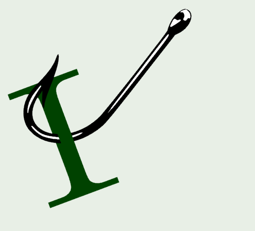

<!-- ## Open-source

## Architecture

## Presenting
 -->
## .NET

[Named Query Filters in EF 10 (multiple query filters per entity)](https://www.milanjovanovic.tech/blog/named-query-filters-in-ef-10-multiple-query-filters-per-entity) by Milan Jovanović

[Metadata Tracking Improvements in Marten](https://jeremydmiller.com/2025/07/27/metadata-tracking-improvements-in-marten/) by Jeremy D. Miller

[Song recommendations with C# Reactive Extensions](https://blog.ploeh.dk/2025/07/21/song-recommendations-with-c-reactive-extensions/) by Mark Seemann

[Solving the source generator 'marker attribute' problem in .NET 10](https://andrewlock.net/exploring-dotnet-10-preview-features-4-solving-the-source-generator-marker-attribute-problem-in-dotnet-10/) by Andrew Lock

[Unexpected inconsistency in records](https://codeblog.jonskeet.uk/2025/07/19/unexpected-inconsistency-in-records/) by Jon Skeet

[.NET and .NET Framework July 2025 servicing releases updates](https://devblogs.microsoft.com/dotnet/dotnet-and-dotnet-framework-july-2025-servicing-updates/) by .NET Team

[Microsoft is planning a huge upgrade for Visual Studio](https://www.neowin.net/news/microsoft-is-planning-a-huge-upgrade-for-visual-studio/) by Usama Jawad

[dotInsights | July 2025 | The .NET Tools Blog](https://blog.jetbrains.com/dotnet/2025/07/15/dotinsights-july-2025/) by Rachel Appel

## Domain Driven Design

[EventStorming: enhancing knowledge transfer in complex domains](https://www.osedea.com/insight/how-eventstorming-facilitated-knowledge-transfer-and-discovery) by Alizée Gottardo

[Microsoft Resiliency Extensions and Polly Part 1 - Building Your First Resilience Pipeline](https://blog.nimblepros.com/blogs/building-your-first-resilience-pipeline/) by Jeff Zuerlein

## DevOps

[Git Branching Strategies](https://www.codemag.com/Article/2507021/Git-Branching-Strategies) by Sahil Malik

<!-- ## Software Design

## Mobile
 -->
## Agile/Work Life

[The Lightning Talk on Kindess](https://sadukie.com/2025/07/24/lightning-talk-on-kindness.html) by Sarah Dutkiewicz

## REST/APIs

[The Intersection of API Rate Limits, Plans & Pricing, and Marketplace Working Things Out](https://apievangelist.com/2025/07/22/the-intersection-of-api-rate-limits-plans-pricing-and-marketplace-working-things-out/) by Kin Lane

## Azure

[Integration testing for Go applications using Testcontainers and containerized databases](https://devblogs.microsoft.com/cosmosdb/integration-testing-for-go-applications-using-testcontainers-and-containerized-databases/) by Azure Cosmos DB Blog

## Software Development

[Refactor if/elseif/elseif using Strategy Design Pattern](https://medium.com/aia-sg-techblog/refactor-if-elseif-elseif-using-strategy-design-pattern-80c51913a539) by Sandesh Gaonkar

[GitHub Spark in public preview for Copilot Pro+ subscribers](https://github.blog/changelog/2025-07-23-github-spark-in-public-preview-for-copilot-pro-subscribers/) by Github Changelog

[How can I wait until a named object (say a mutex) is created?](https://devblogs.microsoft.com/oldnewthing/20250724-00/?p=111406) by Raymond Chen

## Windows

[How to Install Nerd Fonts and Icons in PowerShell 7 on Windows 11](https://ardalis.com/install-nerd-fonts-terminal-icons-pwsh-7-win-11/) by Steve Smith

<!-- ## Security
 -->
## AI

[Vibe coding might cause problems down the road](https://www.theregister.com/2025/07/25/opinion_column_vibe_coding/) by Steven J. Vaughan-Nichols

[One in six US workers pretends to use AI to please bosses ΓÇó The Register](https://www.theregister.com/2025/07/22/ai_anxiety_us_workers/) by Danny Bradbury

<!-- ## Social Media

## Online Tools

## Databases

## Cloud

## Computing
 -->
## Podcasts

[AI Concerns with Mark Seemann](https://www.dotnetrocks.com/details/1960) by .NET Rocks

