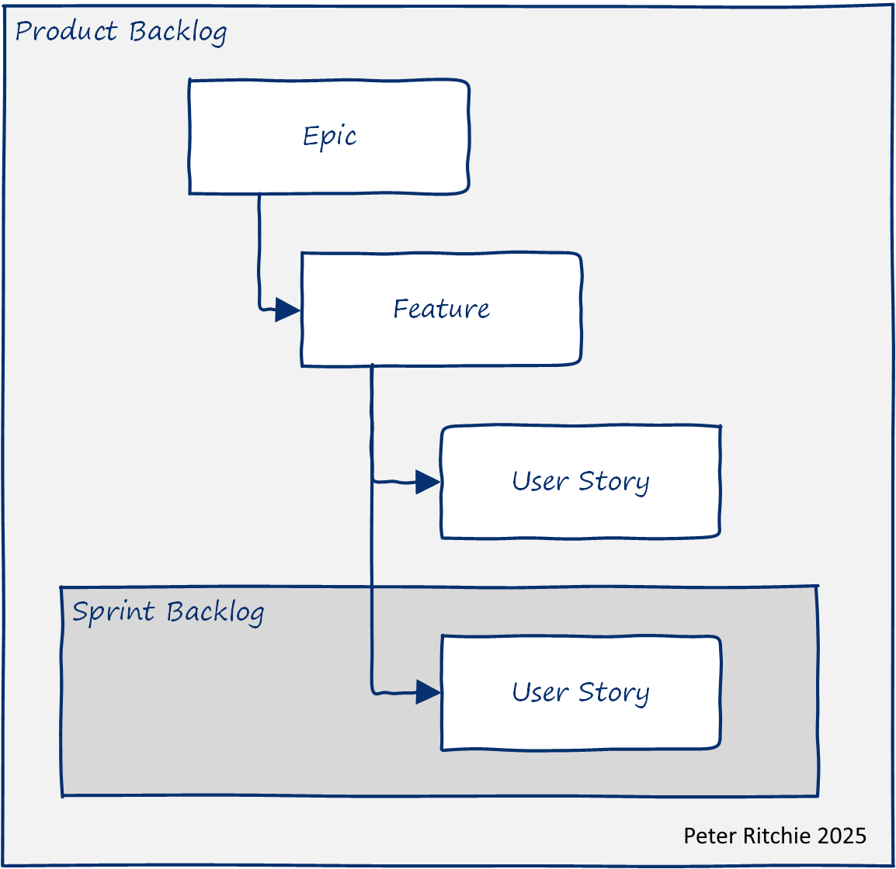
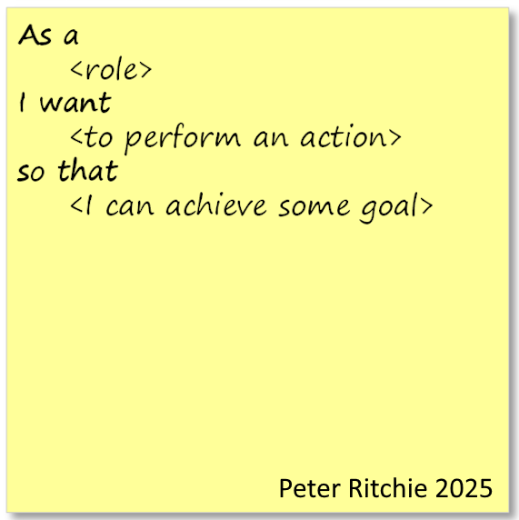
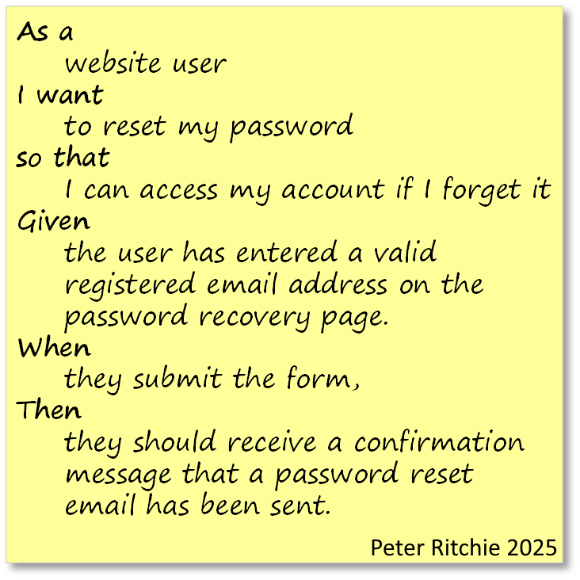

Being a successful software developer is about developing and delivering software that stakeholders find valuable and useful. Getting objective expectations of value from stakeholders can sometimes be difficult. This isn't necessarily a failing of the stakeholder; sometimes, it can be hard to clearly communicate expectations because assumptions and implicit information can lead your audience to have less exact goals. I work with teams frequently challenged with accurately meeting expectations. This post explores some of the particularly helpful techniques.

## Level-setting

The context in which I'll be discussing involves agile techniques for describing and managing requirements, but they are applicable regardless of how you refer to requirements or organize them. A generally accepted method of managing requirements is to have a **product backlog** and a **sprint backlog** that contain **user stories**. A user story's purpose is *to describe a desired capability, from the perspective of a type of stakeholder (role), that provides a tangible benefit*. In addition to a product backlog, a sprint backlog, and user stories, organizations organize the software development efforts with **epics** and **features**. Epics and features help break down work into manageable chunks--aligning it by common purpose. An epic may contain several features related to one another. The epic may also have a theme or strategic goal. A feature is a set of functionality that provides value to stakeholders.

There's a saying:

> There is no right way to do the wrong thing.

One of the goals of agile software development is to ensure we're focusing on the right thing and to be able to quickly pivot when we realize we may be working on the wrong thing. Let's explore ways to improve the likelihood of focusing on the right things early in an agile context, enabling us as software developers to achieve greater success.

A user story takes the form:

For example:
>**As a** *website user*,  
>**I want** *to recover my password*,  
>**so that** *I can access my account if I forget it*.

Although this story sounds complete, measuring its success ultimately hinges on whether the functionality exists, which is lacking in testability. Specifically, it lacks positive testability. As it stands, we can only test that the functionality doesn't crash rather than verifying the value it should provide. With no way to verify the added value, it's also challenging to quantifiably trace that back to an epic in terms of its contribution to a strategic goal. Some teams don't drill down to more detail than a user story with this level of detail (some may have less detail, such as a functional work-item like "Password Reset").

A common way to make it easier to evaluate work completed against a requirement, such as a user story, is to include a series of acceptance criteria.

>As a developer looking to ensure that what they ultimately implement is fit for purpose, collaborating with users/owners on acceptance criteria is very helpful.

A popular format for acceptance criteria is Given/When/Then (or Gherkin syntax), which details preconditions, actions, and expected outcomes. The general format is
Given &lt;some context&gt;, When &lt;some action is carried out&gt;, Then &lt;outcome is observed&gt;. For example:

> **Given**: *the user navigates to the login page*,  
> **When**: *the user selects the "Forgot Password" option and enters a valid email address*,  
> **Then**: *the system sends the password recovery link to the entered email*. 

User stories can easily fall prey to rote creation from a vague checklist item, such as "password reset". This one simple Given/When/Then example has provided important expectations, including *where password reset can occur*, that *an email address is required to reset a password*, and that *the system will send an email to authenticate the correct user*. But a single Given/When/Then scenario is insufficient to represent realistic expectations. For this user story, scenarios covering receipt of the email and performing the reset are necessary to round out the happy-path expectations. For example
> **Given** _the user has entered a valid registered email address on the password recovery page_.  
> **When** _they submit the form_,  
> **Then** _they should receive a confirmation message that a password reset email has been sent_.

and

> **Given** _the user has received the password reset email_.  
> **When** _they click the link in the email and enter a new password_,  
> **Then** _their password will be updated, and they should be able to log in with the new password_.

## Eliciting Acceptance Criteria  

These acceptance criteria may be obvious now that you see them, but when all you've got is a user story, a feature, and an epic, what can we do to get quality acceptance criteria? Fortunately, this example provides some hints. Given/When/Then, "Given" are preconditions; so asking about what preconditions must exist is a good start. "Preconditions" might come across as overly technical, so questions like "**Where would this functionality exist?**", "**How would the user reach this functionality?**" or "**What needs to happen for this functionality to be enabled?"** have served me well.

While working through these questions with the product owner and other stakeholders provides valuable insights for implementing a fit-for-purpose solution, we still lack positive verifiability. We can verify that the functionality achieves the outcomes we've specified, but **what is the value of the outcomes of this functionality**? Pose this question to stakeholders in an effort to discover something quantifiably measurable. Since clearer outcomes are part of the more detailed scenarios, those newly elicited outcomes can hint at more criteria, from the point of view of quality attributes.

Any functionality (i.e., your work) is judged on quality attributes such as its correctness, performance, usability, security, and reliability, to name a few. These quality attributes serve as a great inspiration for eliciting measurable details. So, asking questions about response times, clarity about the type of user/role, error conditions, negative scenarios, etc. For example, you could expand a Given/When/Then scenario to include performance criteria:
> **Given** _the user has entered a valid registered email address on the password recovery page_.  
> **When** _they submit the form_,  
> **Then** _they should receive a confirmation message that a password reset email has been sent_.  
> <u>**And** the confirmation email is sent within 2 minutes</u>.

Or you could update the main scenario with a clearer role:
> **Given**: _<u>an unverified user</u> navigates to the login page_,  
> **When**: _the user selects the "Forgot Password" option and enters a valid email address_,  
> **Then**: _the system sends the password recovery link to the entered email_. 

No matter where you find inspiration for measurability, it's in relation to a goal and or objective. The more measurable business goals and objectives that are known during estimation and before implementation has begun, the more likely it is that you'll implement functionality that stakeholders will find valuable and useful. The criteria exist, and they can manifest in either expectation details or the need to refine an implementation. Think shift-left.

> **If you find this useful**  
> I'm a freelance software architect. If you find this post useful and think I can provide value to your team, please reach out to see how I can help. See [About](/about) for information about the services I provide.
<!-- Calendly inline widget begin -->

<!-- Calendly inline widget end -->