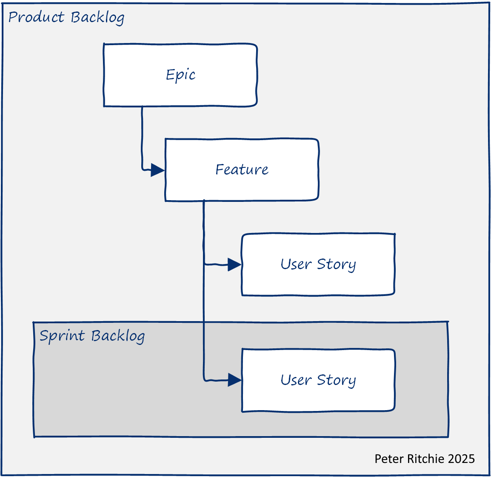

In a [prior post](/posts/being-a-successful-software-developer--agilely-managing-expectations), I discussed agilely managing expectations, where I touched on ensuring user stories include measurable expectation detail by way of acceptance criteria. I detailed how the Gherkin or Given/When/Then format accommodates preconditions, actions, postconditions, and quantifiers. Being able to format the expectations you've gathered is the easy part; the hard part is eliciting those expectations. If you don't already have a set of requirements with the level of detail typically seen in Given/When/Then format, that means no one has discussed expectations at that level of detail. This post will explore some strategies I've used to successfully collaborate with subject matter experts and product owners, helping them set clear expectations.

I've worked with many clients across a diverse range of industries. I have some clients across the same industry, but I wouldn't call myself a domain expert in the domain where nearly all of my clients operate. However, when I start working with a client, I still need to become proficient enough to be productive right away. Let's explore some ways to uncover what inspires expectations.

Those with knowledge of what is needed are very close to the domain and naturally make assumptions, inadvertently leaving out information. We first have to recognize that and try to tease out implicit information to make it explicit. We technical folk want to work with "standard" user stories in a backlog, along with Feature and Epic descriptions.

## Epics And Features Are More Than Groupings

It's easy to view Epics and Features as groupings, but they also represent business needs. Epics and Features both can represent a capability that the business is hoping to obtain. Alternatively, Epics can describe a Strategic Objective of the company. In either case, these needs serve as inspiration for the things under them. Like any hierarchy of goals and objectives, an objective at one level is a goal of the level below it. For example, an Epic may have a Strategic Objective of "Increase Response times by an average of 20%", which will lead to the creation of Features aimed at increasing response times. Features under that Epic should have a _goal_ to contribute to that 20% increase. Stories under that Feature should have measurable _objectives_ (quantifiable acceptance criteria) that contribute to that 20% increase.

At one level, during Story evaluation/refinement, we should be asking ourselves and the subject matter experts: "Is this user Story well aligned with the parent Feature?" That ensures the Story is relevant, but it also ensures the Story is making forward progress on the goals of that Feature. Ensuring forward progress on Feature goals ensures we're addressing the Strategic Objectives of the Epic.

In addition to the Initiative, Epic, Strategic Objective, or Feature, the product and organization are driven by business motivations. These motivations are in addition to the effort of delivering software in the future and are typically focused on the present or operational aspects. Both the organization and the product have a purpose: a Vision and or a Mission. Additionally, an organization has Values that guide all its actions.

This post focuses on being in the context of assessing or refining a User Story (or backlog item). Change happens, and it rarely occurs at scheduled intervals, such as Epic planning or Feature planning. S;print planning is the last point at which the team can recognize change before committing to sprint work. Change can affect more than User Stories; it impacts Features, Epics, the Epic's Strategic Objective, the purpose of the current project, the Product, and even the Vision and Mission of the organization. Therefore, a User Story might feel out of alignment for various reasons, and the assessment should cascade up the hierarchy until everyone involved is comfortable that alignment has been reached.

## Project Goals And Objectives
Project goals and objectives are often quantitative in nature, such as "increase customer retention by 10%" or "improve performance by 25%." In cases like this, a proxy that represents the objective and can be measured against a target needs to be agreed upon. If it's not obvious, it's important to ask subject matter experts how implementing or using this functionality would impact that objective. e.g.: "How will we know that this functionality has increased customer retention?" or "How will we know that this functionality has improved performance?" Often, what this really means is asking, "How do we currently measure, and what is the baseline to compare to?"

For example, you can't specifically measure that functionality has improved customer retention, but you can measure the usage of a Feature. So, acceptance criteria can include usage metrics, such as amounts or durations. These metrics are somewhat one-way, but they do measure that the customer is engaged. When aggregated with usage measures of other functionality, they indicate how engaged the customer is, which can be compared over time.

> Getting someone's heart rate involves taking their pulse over a period of time, which _leads_ to calculating their heart rate.

Usage measures in this case are _leading indicators_ that analysts can use to predict customer retention.

## Organizational Vision
Vision can be subjective and thus qualitative. Assessment of alignment to Vision goes towards whether the functionality is relevant or not. How relevant functionality aids in prioritization, and even deferring functionality entirely.

## Organizational Mission
A mission describes what an organization or product does. This also goes towards whether the proposed functionality is relevant or not&mdash;the result of assessing alignment aids in deciding whether implementing proposed functionality should be deferred or prioritized lower than other efforts.

## Organizational Values
Values that apply to the acceptance criteria for functionality can sometimes be abstract and high-level. However, they can sometimes offer insight into how we can verify functionality. For example, a value like "integrity" or "promote transparency and trust" might lead to acceptance criteria like "confidential information is not stored in clear text" or "passwords are not stored."

Although these motivations influence and guide how the business operates, they also shape what is expected of the software's functionality and quality.

## Project Scope
A Project Scope details what is and isn't included in the deliverables or outcomes of the project. It should be clear what success or acceptance looks like for project completion.

> There is no right way to do the wrong thing.

While this post details how to enhance User Stories with measurable acceptance criteria, we must also recognize that the needs detailed in the product backlog may no longer be relevant. In cases like this, those Stories (and even Features and Epics) should be removed or deferred.

## User Story Unaligned With Feature

Although some user stories have an obvious functional or enabling motive, we typically want quantitative acceptance criteria for the User Story. Those quantifiers should align with the qualifiers and quantifiers of the parent Feature.

A goal or criterion of a Feature might be to improve performance, for example. A Story that contributes to that Feature should have quantifiable acceptance criteria that measure how the Story contributes to improved performance. That User Story might be to add search indexing functionality. The purpose of search indexing may be to improve the performance of the existing search functionality. That existing functionality should have a performance baseline (i.e., the subject of the assessment that search performance was too slow), and to prove that time spent implementing search indexing was successful, there should be a quantifiable amount by which search performance should improve.

Some questions I've found to be valuable at uncovering missing expectations or clarifying expectations:

> What are we hoping to achieve with this functionality?

> I'm not clear on how this functionality contributes to "Feature X", could you help me understand?

If it's hard to get a quantifiable amount of anything for the acceptance criteria of a Story or, especially, if it's difficult to get measurable acceptance criteria for many of the User Stories for a Feature, then that Feature may be unaligned with its parent Epic.

## Feature Unaligned With Epic

Again, change happens at any time, and that can affect the relevance of an Epic or Feature. In the context of User Story assessment, sprint planning, or backlog refinement, a change in circumstances may reveal misalignment introduced by the change. When it feels like the Feature of a Story you're assessing seems misaligned, here are some questions that have worked for me to gain clarity:

> What will this Feature enable users to accomplish?

> What new ability will this Feature give to users?

> I'm not clear on how this Feature contributes to the Strategic Objective of "objective", could you help me understand?

## Epic/Feature/Story Unaligned With Product Vision, Goals, or Scope

Change may impact Project Goals or Project Scope, which might manifest as unclear Epics or Features. If you're questioning the relevance of Feature and its overarching Epic, it may be due to misaligned Project Goals or Project Scope. If a Feature is no longer relevant but is clearly within the project's scope, it's time to reassess the Project Scope. Some questions that have helped me realize Project Scope is misaligned:

> What capability will the organization obtain by successfully completing this Epic?

> What user behavior do we hope to change by successfully completing this Epic?

## Epic/Feature/Story Unaligned With Project Purpose

Change can be so impactful as to bring into question the purpose of the current project. That impact may require reassessment of the project. A project should have a Project Charter that details the Project Purpose, Project Goals, the Project Scope, etc. Change that impact the project's purpose may indicate that replanning the project is necessary.

I've not been in a situation where a project needed to be replanned that wasn't driven by the business. It should be obvious that a project is unlikely to succeed and will either be abandoned or replanned. If not, I'd question how the Features and Stories will realize the Project Purpose. If the Project Goals are unattainable, bringing light to that should be enough to get recognition that the project should be abandoned.

## Prioritization
Business motivations go towards the ability to prioritize Stories and Features. Stories and Features that contribute to specific goals or objectives can be prioritized above other functionality. Functionality that doesn't align with Values or Purpose (such as Vision or Mission) or is outside the scope can be deferred or canceled, ensuring efforts are focused on the right functionality.

> **If you find this useful**  
> I'm a freelance software architect. If you find this post useful and think I can provide value to your team, please reach out to see how I can help. See [About](/about) for information about the services I provide.
<!-- Calendly inline widget begin -->

<!-- Calendly inline widget end -->