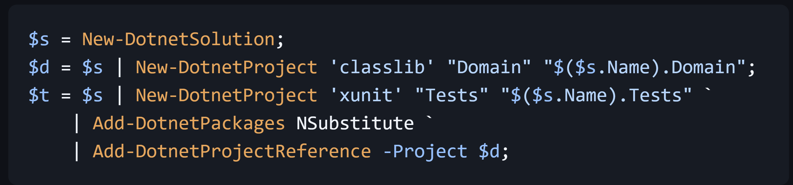
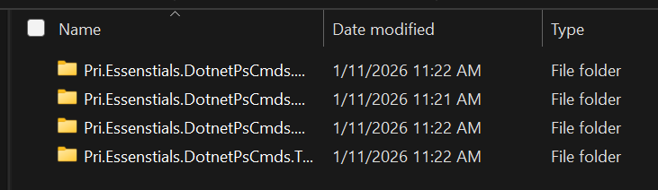

Have you ever wondered why there aren't PowerShell Cmdlets similar to dotnet CLI commands?

I've played around with some PowerShell scripts&mdash;including some scripts for scaffolding various .NET projects&mdash;and some C#-based CmdLets for various things. But I decided to take that experience to the next level by publishing a PowerShell module that provides dotnet CLI functionality while leveraging PowerShell idioms and features.

PowerShell has some interesting features that can make working in the command-line and building scripts a little nicer. One of those features is pipelining. Cmd and Bash have pipes, I know; but PowerShell takes it a step further by supporting object-oriented pipelining. A PowerShell CmdLet can have a .NET object as output (not just text) and can be propagated through the PowerShell command pipeline.

## MVP

The initial (pre) release is very much an MVP--it provides what I consider minimal functionality to support scaffolding .NET solutions and projects.  It essentially wraps dotnet CLI commands adding some convenience and opinions ("opinionation"?) to defaults and some features.

To get started with the cmdlets, you can import the module from the PowerShell Gallery:

```pwsh
Install-Module -Name Pri.Essentials.DotnetPsCmds
```

As this release builds on the .NET CLI, the .NET CLI still needs to be installed.

### Creating a Solution
To create a solution in the current directory, with a solution name matching the name of the current directory (equivalent of `dotnet new sln`):

```pwsh
$s = New-DotnetSolution;
```

The output of this cmdlet is a object-oriented representation of the new solution.

### Creating a Project

To create a project (a `classlib` project) in a new `Domain` directory with a project name of `MyProduct.Domain` (equivalent of `dotnet new classlib -o Domain -n MyProduct.Domain`).

```pwsh
$d = New-DotnetProject 'classlib' Domain MyProduct.Domain;
```

The output of this cmdlet is a object-oriented representation of the new project.

### Adding Package References

With object instances of projects and solutions, we can now re-use those objects for other commands, like adding package references to a project:

```pwsh
$t = New-DotnetProject 'xunit' MyProduct/Tests MyProduct.Tests;
Add-DotnetPackages -PackageIds NSubstitute -Project $t;
```

### Adding Project References

Similar to adding package references, project objects can be re-used when a project needs to reference another project:

```pwsh
$t = New-DotnetProject 'xunit' MyProduct/Tests MyProduct.Tests;
$d = New-DotnetProject 'classlib' Domain MyProduct.Domain;
Add-DotnetProjectReference -Project $d -TargetProject $t;
```

### Leveraging Pipelining

DotNet PowerShell Commands support pipelining. For example, the output of `New-DotnetSolution` can be piped to `New-DotnetProject` to add the newly created project to the newly created solution:

```pwsh
New-DotnetSolution | New-DotnetProject 'classlib' Domain MyProduct.Domain;
```

You can store the solution object in a variable to enable adding multiple new projects to the solution:

```pwsh
$s = New-DotnetSolution;
$s | New-DotnetProject 'classlib' Domain MyProduct.Domain;
$s | New-DotnetProject 'xunit' Test MyProduct.Tests;
```

And pipelining works with adding package references:

```pwsh
$t = New-DotnetProject 'xunit' MyProduct/Tests MyProduct.Tests;
$t | Add-DotnetPackages -PackageIds NSubstitute;
```

As well as project references:

```pwsh
$d = New-DotnetProject 'classlib' Domain MyProduct.Domain;
New-DotnetProject 'xunit' Tests MyProduct.Tests `
    | Add-DotnetProjectReference -Project $d;
```

Or with project references _**and**_ package references:

```pwsh
$d = New-DotnetProject 'classlib' Domain MyProduct.Domain;
$t = New-DotnetProject 'xunit' Tests MyProduct.Tests `
    | Add-DotnetPackages NSubstitute `
    | Add-DotnetProjectReference -Project $d;
```

### Leveraging Objects

You can leverage properties of objects to avoid repeating yourself when creating solutions and projects with namespaces. For example, rather than having the "MyProduct" portion of the namespace/filename repeated, you can use the solution's `Name` property (assuming the current directory has the correct name as the "product name"):

```pwsh
$s = New-DotnetSolution;
$d = $s | New-DotnetProject 'classlib' "Domain" "$($s.Name).Domain";
$t = $s | New-DotnetProject 'xunit' "Tests" "$($s.Name).Tests" `
    | Add-DotnetPackages NSubstitute `
    | Add-DotnetProjectReference -Project $d;
```
Which, with equivalent to the following with `dotnet`:

```pwsh
dotnet new sln
dotnet new classlib -o Domain -n MyProduct.Domain
del Domain/Class1.cs
dotnet sln add Domain --in-root
dotnet new xunit -o Tests -n MyProduct.Tests
del Tests/UnitTest1.cs
dotnet add Tests package NSubstitute
dotnet add Tests reference Domain
dotnet sln add Tests --in-root
```

(For details on deleting Class1.cs and UnitTest1.cs, see below.)

## Opinionated

I mentioned DotNet PowerShell Commands is opinionated in certain respects, here's where.

### Solution Folders For Projects

I noticed recently that adding projects to a solution (`dotnet sln add`) automatically creates solution folders for projects whose name wasn't identical to the parent folder _and doesn't add solution folders when the names are identical_. (Using `-o` _and_ `-n` with `dotnet new <template>` creates a project with a different name from the directory name.) Personally, I find it cumbersome to navigate the file system and especially repos like GitHub when I have project folders that match the project file name and fully-qualified project names (for the sake of default namespaces). e.g. `repos/Pri.Essentials.DotnetPsCmds/src/Pri.Essentials.DotnetPsCmds/Pri.Essentials.DotnetPsCmds.csproj` and tend toward shortened directory names for navigability and readability (`repos/DotnetPsCmds/src/DotnetPsCmds/Pri.Essentials.DotnetPsCmds.csproj`) because directory listings often just show a less than useful truncated list of folders that appear to have the same name (Maybe this is better solved with support for setting the default namespace when creating a project? But `dotnet` doesn't support that. &#x1F609;)



The implementation for this currently manifests in DotNet PowerShell Commands by using `--in-root` with `dotnet sln add` to avoid the creation of solution folders with new projects.

### `Class1.cs`

Personally, the first thing I do when creating a class library project via `dotnet` or Visual Studio is to delete the `Class1.cs` file. DotNet PowerShell Commands automatically deletes this file when it creates a `classlib` project. I'm assuming users of DotNet PowerShell Commands are intermediate to advanced and feel the same way. 

### `UnitTest1.cs`

DotNet PowerShell Commands does the same thing with `UnitTest1.cs` in `xunit`/`xunit3` projects as it does with `Class1.cs` in `classlib` projects. 

## Extra Features, So Far

Over and above what `dotnet` provides, DotNet PowerShell Commands also allows creating a custom solution folder when adding a project to a solution via `Add-DotnetProject` (not to be confused with `New-DotnetProject`). This is partially to circumvent the opinionated view that hardly anyone would want a solution folder per project by default. But this provides extra value in that if you use the same folder name with the addition multiple projects, all the projects will be grouped in the same solution folder.

```pwsh
$d = New-DotnetProject 'classlib' Domain MyProduct.Domain;
$s = New-DotnetSolution;
$s | Add-DotnetProject -Project $d -SolutionFolder MyFolder;
```

## More details

For more details, please see the [open-source project on GitHub](https://github.com/peteraritchie/Pri.Essentials.DotnetPsCmds#dotnet-powershell-cmdlets). In there you'll find a more thorough [README](https://github.com/peteraritchie/Pri.Essentials.DotnetPsCmds#dotnet-powershell-cmdlets) that goes into a bit more detail on CmdLets and examples. You can also create [issues](https://github.com/peteraritchie/Pri.Essentials.DotnetPsCmds/issues) or [discussions](https://github.com/peteraritchie/Pri.Essentials.DotnetPsCmds/discussions) with questions/suggestions in addition to [contributing](https://github.com/peteraritchie/Pri.Essentials.DotnetPsCmds/blob/main/CONTRIBUTING.md#contributing-to-this-net-project).

I'd like to pull together a simple roadmap for what I'm thinking for this in the near future. Some things I'm thinking so far are:
- supporting `slnx` files (by default?)
- Templated solutions: creating all the parts of common solution templates in a single command.
- supporting solution-level features like Directory.Build.props, global.json
- GitHub repo features like workflows, dependabot, etc.
- Support modifying project-level properties via commands (like `GenerateDocumentationFile`, `PublishRepositoryUrl`, etc.)

> **If you find this useful**  
> I'm a freelance software architect. If you find this post useful and think I can provide value to your team, please reach out to see how I can help. See [About](/about) for information about the services I provide.
<!-- Calendly inline widget begin -->
<div class="calendly-inline-widget" data-url="https://calendly.com/peterritchie/client-meet-greet-zoom" style="min-width:320px;height:700px;"></div>
<script type="text/javascript" src="https://assets.calendly.com/assets/external/widget.js" async></script>
<!-- Calendly inline widget end -->