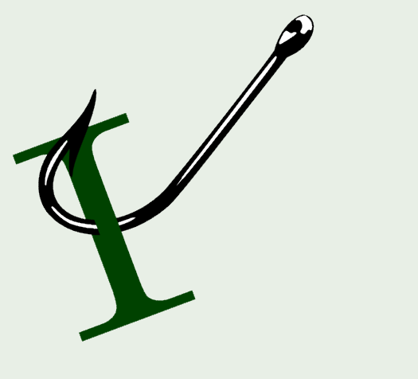

<!-- ## Security

## Open-source

## Domain-Driven Design, CQRS
 -->
## Software Architecture

[Kafka Is Not An Event Store](https://karoxi.dev/blog/kafka_not_an_event_store?utm_source=blog.peterritchie.com) by karoxi

[Just Use Postgres as a Queue?](https://codeopinion.com/just-use-postgres-as-a-queue/?utm_source=blog.peterritchie.com) by Derek Comartin

<!--## GitHib

## Presenting
 -->
## .NET

[ReSharper Made VS Code a Real Option for My .NET Work](https://www.woodruff.dev/resharper-made-vs-code-a-real-option-for-my-net-work/?utm_source=blog.peterritchie.com) by Chris Woodruff

[Display project Attribute (C#)](https://dev.to/karenpayneoregon/display-project-attribute-c-319d?utm_source=blog.peterritchie.com) by Karen Payne

[What's new for .NET in Ubuntu 26.04](https://devblogs.microsoft.com/dotnet/whats-new-for-dotnet-in-ubuntu-2604/?utm_source=blog.peterritchie.com) by Richard Lander

[Give .NET Its Props - Central Package Management](https://barretblake.dev/posts/development/2026/04/give-dotnet-its-props/?utm_source=blog.peterritchie.com) by Barret Blake

[Like Vertical Slice Architecture? Meet Wolverine.Http!](https://jeremydmiller.com/2026/04/22/like-vertical-slice-architecture-meet-wolverine-http/?utm_source=blog.peterritchie.com) by Jeremy D. Miller

[.NET 10.0.7 Out-of-Band Security Update](https://devblogs.microsoft.com/dotnet/dotnet-10-0-7-oob-security-update/?utm_source=blog.peterritchie.com) by Rahul Bhandari (MSFT)

[EF Core is Better with Wolverine – The Shade Tree Developer](https://jeremydmiller.com/2026/04/21/ef-core-is-better-with-wolverine/?utm_source=blog.peterritchie.com) by Jeremy D. Miller

[Removing byte[] allocations in .NET Framework using ReadOnlySpan<T>](https://andrewlock.net/removingbyte-array-allocations-in-dotnet-framework-using-readonlyspan-t/?utm_source=blog.peterritchie.com) by Andrew Lock

[Customizing the Wolverine Code Generation Model – The Shade Tree Developer](https://jeremydmiller.com/2026/04/20/customizing-the-wolverine-code-generation-model/?utm_source=blog.peterritchie.com) by Jeremy D. Miller

<!-- ## Conferences and Speaking

## Domain Driven Design

## DevOps

## Software Design

## Mobile

## Agile/Work Life

 -->
## Project Management/Administration

[Product Management with GenAI: What Changes and What Doesn't](https://agilepainrelief.com/blog/product-management-and-genai/?utm_source=blog.peterritchie.com) by Mark Levison

## REST/APIs

[With API Knowledge Comes Great Power](https://apievangelist.com/blog/2026/04/24/with-api-knowledge-comes-great-power/?utm_source=blog.peterritchie.com) by Kin Lane

## Azure

[Azure MCP Server now available as an MCP Bundle (.mcpb)](https://devblogs.microsoft.com/azure-sdk/azure-mcp-server-mcpb-support/?utm_source=blog.peterritchie.com) by Victor Colin Amador

[Axios npm Supply Chain Compromise – Guidance for Azure Pipelines Customers](https://devblogs.microsoft.com/devops/axios-npm-supply-chain-compromise-guidance-for-azure-pipelines-customers/?utm_source=blog.peterritchie.com) by Josef Sin

[Write azd hooks in Python, JavaScript, TypeScript, or .NET](https://devblogs.microsoft.com/azure-sdk/azd-multi-language-hooks/?utm_source=blog.peterritchie.com) by Kristen Womack

[7 tips to optimize Azure Cosmos DB costs for AI and agentic workloads](https://devblogs.microsoft.com/cosmosdb/7-tips-to-optimize-azure-cosmos-db-costs-for-ai-and-agentic-workloads/?utm_source=blog.peterritchie.com) by Michal Toiba

[Optimizing Git policy management at scale](https://devblogs.microsoft.com/devops/optimizing-git-policy-management-at-scale/?utm_source=blog.peterritchie.com) by Azat Galiev

[Azure SDK Release (April 2026)](https://devblogs.microsoft.com/azure-sdk/azure-sdk-release-april-2026/?utm_source=blog.peterritchie.com) by Ronnie Geraghty

[General Availability: Dynamic Data Masking for Azure Cosmos DB](https://devblogs.microsoft.com/cosmosdb/general-availability-dynamic-data-masking-for-azure-cosmos-db/?utm_source=blog.peterritchie.com) by Sudhanshu Khera

[Azure DevOps MCP Server April Update](https://devblogs.microsoft.com/devops/azure-devops-mcp-server-april-update/?utm_source=blog.peterritchie.com) by Dan Hellem

## Software Development

[The Test Pyramid Is a Lie (and What I Do Instead)](https://www.milanjovanovic.tech/blog/the-test-pyramid-is-a-lie-and-what-i-do-instead?utm_source=blog.peterritchie.com) by Milan Jovanović

[Highlights from Git 2.54](https://github.blog/open-source/git/highlights-from-git-2-54/?utm_source=blog.peterritchie.com) by Taylor Blau

<!-- ## Windows
 -->
## AI

[Vibe Coding Will Break Your Company](https://www.forbes.com/sites/jasonwingard/2026/04/23/vibe-coding-will-break-your-company/?utm_source=blog.peterritchie.com) by Dr. Jason Wingard

[The AI Great Leap Forward (a warning)](https://mamund.substack.com/p/the-ai-great-leap-forward-a-warning?utm_source=blog.peterritchie.com) by Mike Amundsen

[Vibing, Harness and OODA loop](https://www.architecture-weekly.com/p/vibing-harness-and-ooda-loop?utm_source=blog.peterritchie.com) by Oskar Dudycz

[Setting Up Claude Code Agent Teams With Wsl2 and Tmux on Windows](https://ardalis.com/setting-up-claude-code-agent-teams-with-wsl2-and-tmux-on-windows/?utm_source=blog.peterritchie.com) by Ardalis (Steve Smith)

[Are we the parents in the AI Agent relationship? The drama continues](https://www.josephguadagno.net/2026/04/20/are-we-the-parents-in-the-ai-agent-relationship?utm_source=blog.peterritchie.com) by Joseph Guadagno

[GitHub Copilot meets Azure Developer CLI: AI-assisted project setup and error troubleshooting](https://devblogs.microsoft.com/azure-sdk/azd-copilot-integration/?utm_source=blog.peterritchie.com) by Kristen Womack

[Changes to GitHub Copilot Individual plans](https://github.blog/news-insights/company-news/changes-to-github-copilot-individual-plans/?utm_source=blog.peterritchie.com) by Joe Binder

<!-- ## Social Media

## Online Tools

## Databases

## Cloud

## Computing

## Podcasts

## Other Link Collections

-->