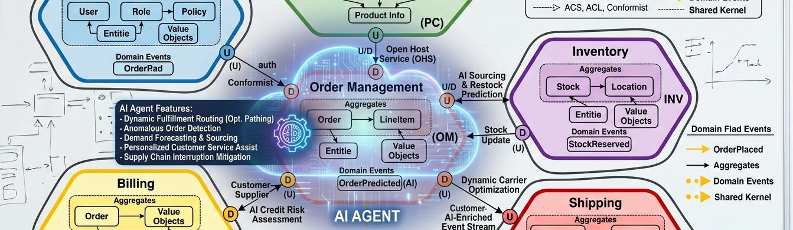

Generative AI can generate slop, but with care and attention it also can generate useful information. Whether generative AI produces useful information comes down to how AI is used. 

This post, the first in a series of in the trenches with DDD and AI, introduces AI's capabilities, limitations, and posits that Aspects of Domain-Driven Design are ideal for improving AI usage for generating code. The series will continue digging deeper into rethinking how to use AI agents through the lense of Domain-Driven Design.

Generative AI is a tool that can be leveraged to aid in the delivery of useful software. Any tool can be misinterpreted in the vein of the _golden hammer cognitive bias_ ([Law of the Instrument][loi]): as the only-tool-you'll-ever-need. Or it can be included with other productive tools in a cohesive tool belt. The craftsperson that assembles a valuable tool belt knows each tool inside and out, including what the design purpose of the tool and its intended usage. Being productive with generative AI depends on having a high-level understanding of what it does and understanding its limitations.

<!-- how it works-->
"AI" is an umbrella term that can mean several things. Contemporary "AI" means _agentic AI_ leveraging a large language model (LLM), specifically a generative pre-trained transformer (GPT) large language model. I.e., ChatGPT, Claude, Microsoft Copilot, Gemini, etc. A GPT is pre-trained on large datasets (in the realm of "all of the Internet") and statistically predicts the next piece of information in a sequence. LLM/GPT "training" is essentially the process of extracting meaning of tokenized training data as vectorized data (embeddings). (use of "LLM" beyond this point means the GPT variant, to avoid confusion with ChatGPT) Agent input is also tokenized and vectorized. Vectors establish multidimensional relationships between the meaning of tokenized data (tokens), essentially allowing an agent to determine closeness (similarity) in meaning of input context to training data (attention). Based on the meaning of a sequence of information, and known information with similar meaning, an LLM can determine the statistical probability the next most likely element in the sequence. When performed iteratively, dozens to hundreds of times, an agent can determine a likely meaning of a prompt response and transform that meaning into a complex answer tailored to the input context.

|Note|
|---|
|A token is a representation of something that can have meaning and is not necessarily a "word".|

An "oversimplification" to say the least but suffice it to say LLMs are not magic, LLMs do not "reason" and factually verify, LLMs do not generate new meaning but recognize meaning patterns, response quality depends on input context cohesiveness, and inputs destined for the context may not fit in the context window and go through the lossy process of compaction to trim information.

So, effective use of LLMs means establishing a session context scoped to information as close to the same meaning as the ideal responses so it's not diluted. This is not an easy task, implying circular reasoning (begging the question) of needing to know the correct response to engineer the ideal prompt context. Establishing an ideal session context is a process that requires trial and error (turns) and iterative clarification and disambiguation of the context.

Additionally, the intent AI agent output should be the achievement of goals outlined in a product roadmap or strategy or contribute to product vision. Advancing such plans depends on breaking the goals into smaller goals and objectives often along enterprise lines like business objectives, product capabilities, and product operational tasks. Context Engineering depends on having these plans and how to measure progress against them. Measuring progress at any point in time with complex and numerous goals requires prioritizing and logically grouping them.

<!-- limitations -->
LLM agents (chats) also have some inherent limitations. They are stateless: LLMs don't remember or immediately learn from any context you give them. A chat session's "memory" includes the chat history in the context--effectively replaying the chat on every turn, including what didn't work (compounding error). The context is of limited size, called a "window". Agents don't fail when the context size becomes larger than the window, they discreetly compact it to remove information while trying not to affect the basic meaning.

Off-the-shelf LLMs are trained on publicly available information, they can't related meaning to Unknown information (proprietary or confidential information). For LLMs to utilize confidential information it must be provided in the context, as missing data can result in "hallucinations" where the only information with likely similar meaning is ambiguous and realistically unrelated.

While improving the effectiveness of AI agent usage and the applicability of their responses comes down to Context Engineering, Context Engineering is nuanced and complex. Context Engineering depends on managing a larger set of information, parts of which are selectively used in individual LLM sessions. It recognizes that multiple, unique sessions are required to progress dynamic plans, each tailored a measurable goal. Enterprise plans drive the prioritization of session invocation.

In other words,

Context Engineering depends on the following:
- Adapting to business plans: business process, business and product strategy, business and product objectives
- Identifying, organizing, storing, sharing, and using an organization's collective information and expertise (Knowledge Management)
- Managing business information: business behaviors, artifacts, roles, relationships, etc.
- A structural direction to the implementation (frameworks, modules, components, etc.)

And Context Engineering involves:
- Isolating context by breaking sessions down by goal or objective
- Prioritizing session invocations
- Scoping context to focus on meaning related to the session objective
- Measuring whether and to what degree responses achieve the objective
- Applying critical thinking to existing knowledge based on generated results and enabling knowledge refinement

In many ways leveraging agentic/generative AI has challenges similar to those that agile software development teams encounter. Those teams address those challenges with agile methodologies, complemented by Domain-Driven Design practices. Future posts in this series will dig into how to get started, gain traction, and how to use Domain-Driven Design techniques facilitate Context Engineering.

[loi]: https://en.wikipedia.org/wiki/Law_of_the_instrument